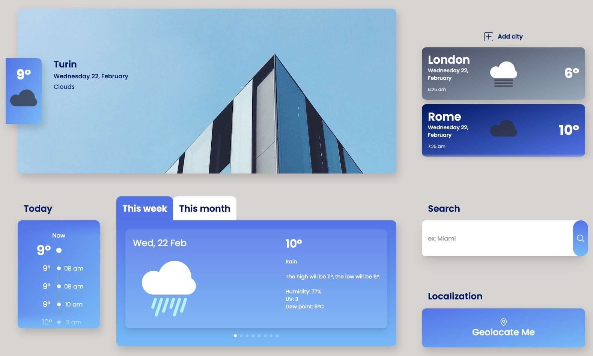

# Weather App - Created as take home test for [Enhancers](https://enhancers.it/en/)

## ⚒️ Tech Stack

React.js - Redux (RTK Query) - TailwindCSS - OpenWeather API

Simple web application to display current and forecast weather data from any city.

## Features

- change the selected city from a prefilled list of cities
- add a custom city with the search field
- get temperature informations for next 48 hours
- get weekly forecast for the entire week ahead
- ability to get current and forecast weather information for your current position with Geolocation API
